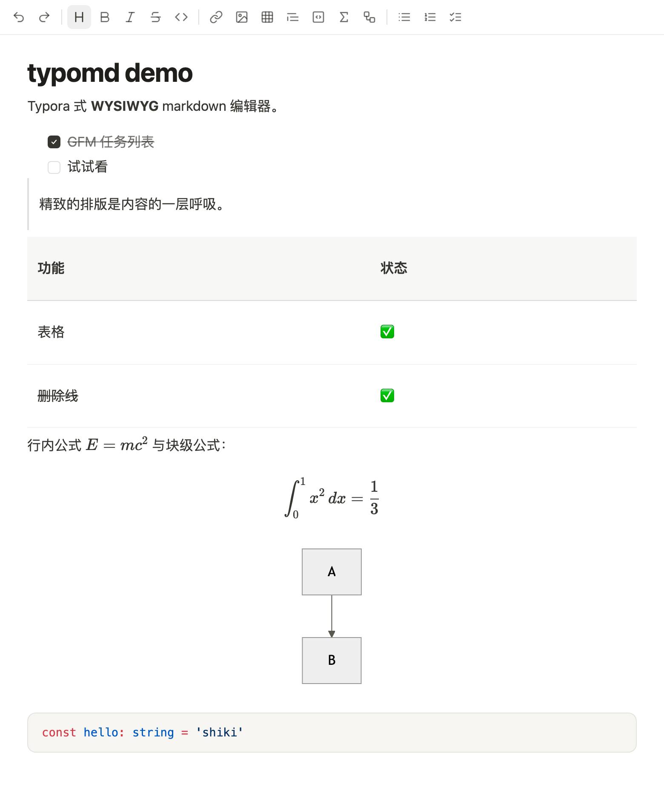
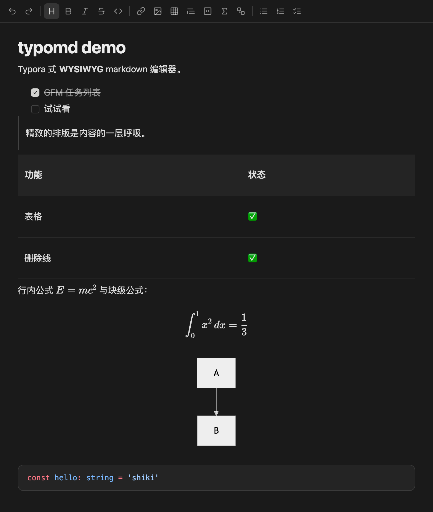
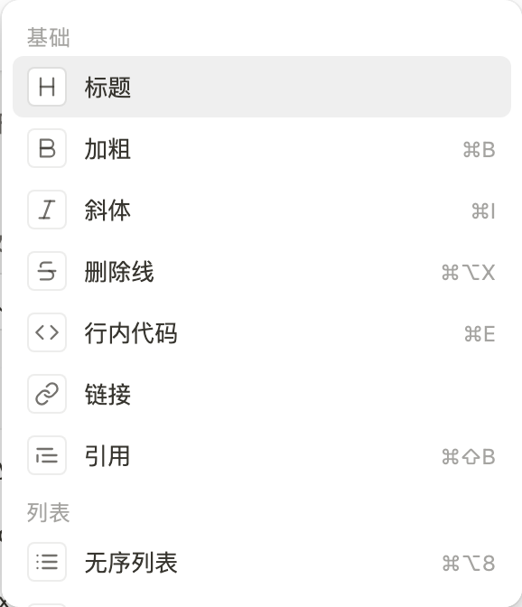
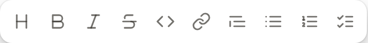

# typomd

[English](./README.md) · [简体中文](./README.zh-CN.md)

[](https://www.npmjs.com/package/@typomd/react)
[](./LICENSE)
[](https://ximing.github.io/typomd/)

Typora-like **WYSIWYG Markdown** editor for React. You type Markdown; you see formatted text. The document is always Markdown — no proprietary JSON as source of truth.

**[Live demo →](https://ximing.github.io/typomd/)**





## Features

- **WYSIWYG Markdown** — headings, lists, quotes, tables, task lists, GFM strikethrough
- **Slash menu** — type `/` to insert blocks (headings, lists, code, math, Mermaid, …)
- **Floating toolbar** — select text to bold / italic / link / lists
- **Math** — KaTeX inline `$...$` and block `$$...$$`
- **Diagrams** — Mermaid fences, light/dark aware
- **Code** — Shiki highlighting, languages loaded on demand
- **Images** — paste or drop with your own upload hook
- **Themes** — light, dark, or follow the system; override with CSS variables
- **Accessible** — keyboard toolbar, focus rings, `prefers-reduced-motion`

<p>
  
  
</p>

## Install

```bash
npm install @typomd/core @typomd/react @typomd/theme
```

Peer: React 18.3+ or 19.

## Quick start

```tsx
import { useRef } from 'react'
import { Typomd, type EditorHandle } from '@typomd/react'
import '@typomd/theme/default.css'
import '@typomd/react/styles.css'

export function App() {
  const editorRef = useRef<EditorHandle>(null)

  return (
    <Typomd
      ref={editorRef}
      defaultValue="# Hello typomd"
      placeholder="Type / for commands…"
      features={{
        math: true,
        mermaid: true,
        codeHighlight: true,
        slash: true,
        floatingToolbar: true,
      }}
      toolbar={{ visible: true }}
      onChange={(markdown) => console.log(markdown)}
      onUploadImage={async (file) => {
        // upload, then return a public URL
        return { src: URL.createObjectURL(file), alt: file.name }
      }}
    />
  )
}
```

Read the current document:

```ts
editorRef.current?.getMarkdown()
editorRef.current?.setMarkdown('# replaced\n')
editorRef.current?.insert('**bold**')
editorRef.current?.execCommand('bold')
editorRef.current?.focus()
```

## Using the editor

### Toolbar, slash, selection bar

| Action | How |
| --- | --- |
| Format a line | Click the top toolbar, or type `/` and pick a command |
| Format a selection | Select text — a floating bar appears |
| Insert math / Mermaid / table / image | `/` then choose from **Media** |
| Undo / redo | Toolbar or `⌘Z` / `⌘⇧Z` |

Slash menu and toolbars share the same command registry, so labels stay consistent.

### Markdown you can type

| You type | You see |
| --- | --- |
| `# Title` | Heading |
| `- item` / `1. item` / `- [ ] task` | Lists |
| `> quote` | Block quote |
| `**bold**` `*italic*` `~~strike~~` `` `code` `` | Marks |
| `$E=mc^2$` / `$$...$$` | KaTeX |
| ` ```ts ` / ` ```mermaid ` | Highlighted code / diagram |

Markdown is the only stored format. `onChange` gives you the canonical string (and a ProseMirror JSON snapshot if you need it).

### Keyboard

| Shortcut | Command |
| --- | --- |
| `⌘B` | Bold |
| `⌘I` | Italic |
| `⌘E` | Inline code |
| `⌘⌥X` | Strikethrough |
| `⌘⇧B` | Quote |
| `⌘⌥C` | Code block |
| `⌘⌥8` / `⌘⌥7` | Bullet / ordered list |
| `/` | Slash menu |
| `Esc` | Close menus / return focus |

On Windows/Linux, `⌘` is `Ctrl`.

## Theming

Three CSS entries:

| Import | Behavior |
| --- | --- |
| `@typomd/theme/default.css` | Light by default; add `.typomd-dark` on any ancestor (usually `<html>`) for dark |
| `@typomd/theme/auto.css` | Follows `prefers-color-scheme` |
| `@typomd/theme/tokens.json` | Token map for custom builds / React Native |

Override any token:

```css
:root {
  --typomd-color-accent: #0f766e;
  --typomd-radius-md: 8px;
}
```

### Avoid a light flash in dark mode

If you toggle `.typomd-dark` from JavaScript after paint, the first frame is light. Inline this in `<head>`:

```html
<script>
  ;(function () {
    try {
      var t = localStorage.getItem('your-theme-key')
      if (t ? t === 'dark' : matchMedia('(prefers-color-scheme: dark)').matches) {
        document.documentElement.classList.add('typomd-dark')
      }
    } catch (e) {}
  })()
</script>
```

## API

### `<Typomd>`

| Prop | Type | Default | Notes |
| --- | --- | --- | --- |
| `defaultValue` | `string` | `''` | Uncontrolled initial Markdown |
| `placeholder` | `string` | | Shown when the doc is empty |
| `readOnly` | `boolean` | `false` | |
| `features.math` | `boolean` | `true` | KaTeX |
| `features.mermaid` | `boolean` | `true` | Mermaid |
| `features.codeHighlight` | `boolean` | `true` | Shiki |
| `features.slash` | `boolean` | `true` | `/` menu |
| `features.floatingToolbar` | `boolean` | `true` | Selection bar |
| `toolbar.visible` | `boolean` | `true` | Hide the top bar only |
| `toolbar.items` | `(string \| render)[]` | built-in | Command ids, `'\|'` separators, or custom renderers |
| `onChange` | `(md, json) => void` | | Debounced Markdown + JSON |
| `onChangeDebounce` | `number` | | ms |
| `onError` | `(err) => void` | | Preset failures (bad math, etc.) |
| `onUploadImage` | `(file) => Promise<{src, alt?}>` | | Required for image insert / paste / drop |
| `ref` | `EditorHandle` | | Imperative API |

### `EditorHandle`

```ts
getMarkdown(): string
setMarkdown(markdown: string): void  // no onChange; clears undo
getJSON(): Record<string, unknown>
focus(): void
insert(markdown: string): void
execCommand(name: string, args?: unknown): void
setReadOnly(readOnly: boolean): void
on(event, cb): () => void            // 'change' | 'selectionChange' | 'slashTrigger' | 'error'
destroy(): void
```

`setMarkdown` replaces the document, drops pending `onChange`, and resets undo — use it for loading files, not for keystrokes.

### Headless core

Need the editor without React chrome? Use `@typomd/core`:

```ts
import { createEditor } from '@typomd/core'

const handle = await createEditor({
  root: document.getElementById('host')!,
  defaultValue: '# Hi',
  onChange: (md) => {},
})
```

## Packages

| Package | What it is |
| --- | --- |
| [`@typomd/react`](https://www.npmjs.com/package/@typomd/react) | `<Typomd>`, toolbar, floating bar, slash menu |
| [`@typomd/core`](https://www.npmjs.com/package/@typomd/core) | Headless editor + command registry |
| [`@typomd/theme`](https://www.npmjs.com/package/@typomd/theme) | CSS variables, light/dark, `tokens.json` |
| [`@typomd/react-native`](https://www.npmjs.com/package/@typomd/react-native) | Bridge **types** only in 1.x (see `BRIDGE.md`) |

## Develop

```bash
pnpm install
pnpm build
pnpm test
pnpm typecheck
pnpm --filter demo dev    # http://localhost:5173
pnpm e2e
```

Requires Node 18+ and pnpm 9.5+.

## License

[MIT](./LICENSE) © 2025 ximing
